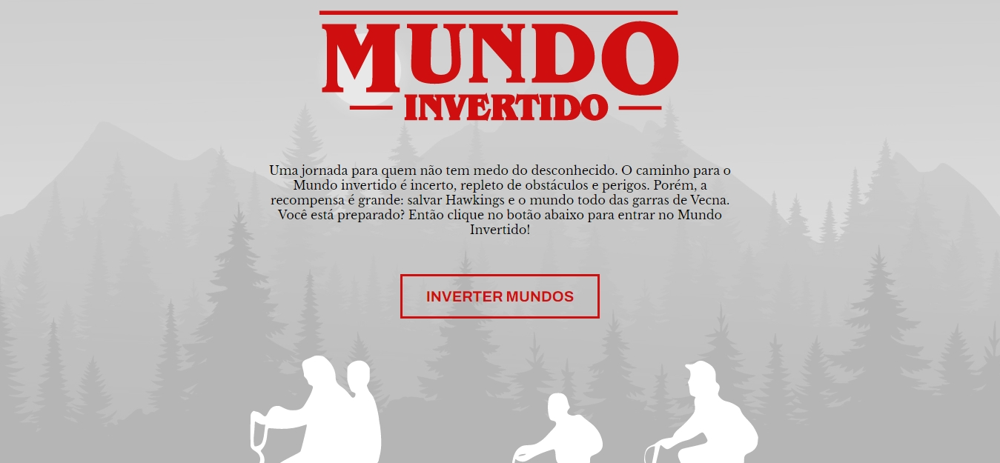

<h1 align="center">Mundo Invertido</h1>

<h1>
    
</h1>

# INDICE
- [Sobre](#- Sobre)
- [Tecnologia utilizada no projeto frontend]
(#- Tecnologia-utilizada-no-projeto-frontend)
- [Tecnologia utilizada no projeto backend]
(#- Tecnologia-utilizada-no-projeto-backend)

# Sobre
O projeto foi criado baseado do filme Stranger Things "Mundo Invertido" na semana do desenvolvedor front-end pela (DIO) Digital Innovation One 

## Tecnologia utilizada no projeto frontend
- HTML
- CSS
- Javascript

## Tecnologia utilizada no projeto backend
- Firebase